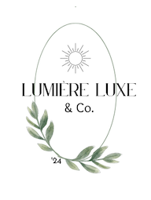
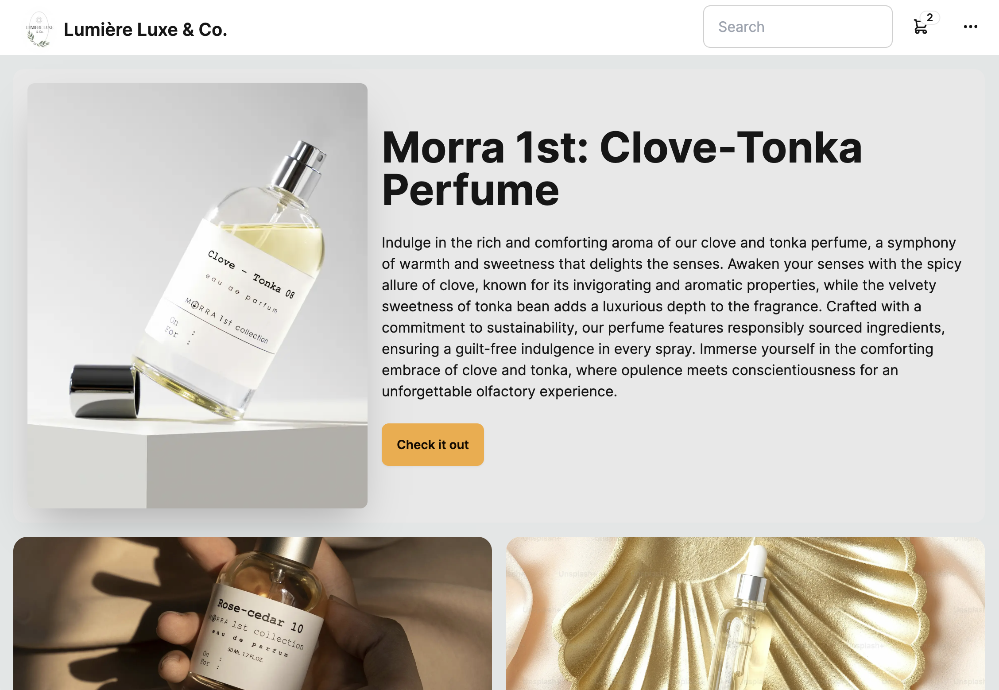
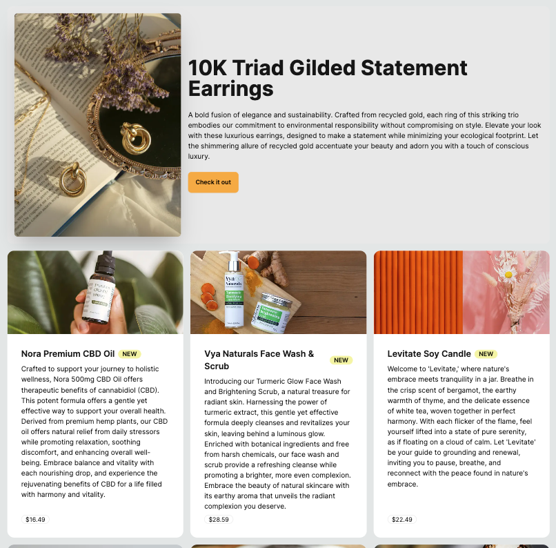
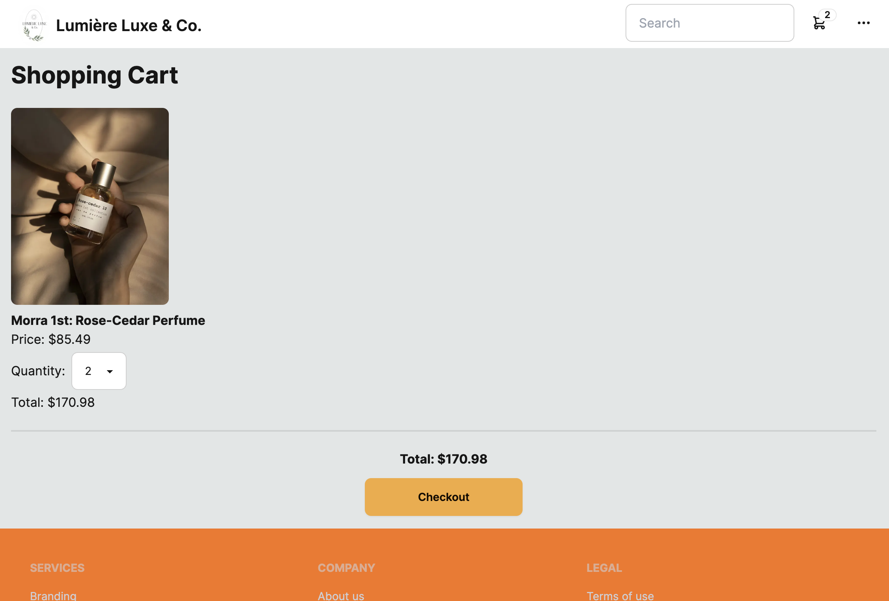
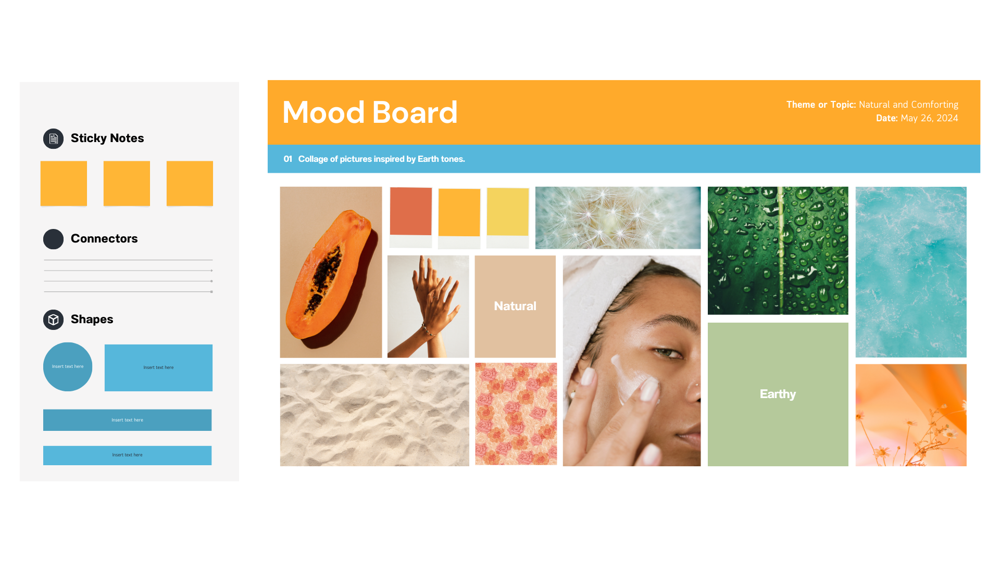
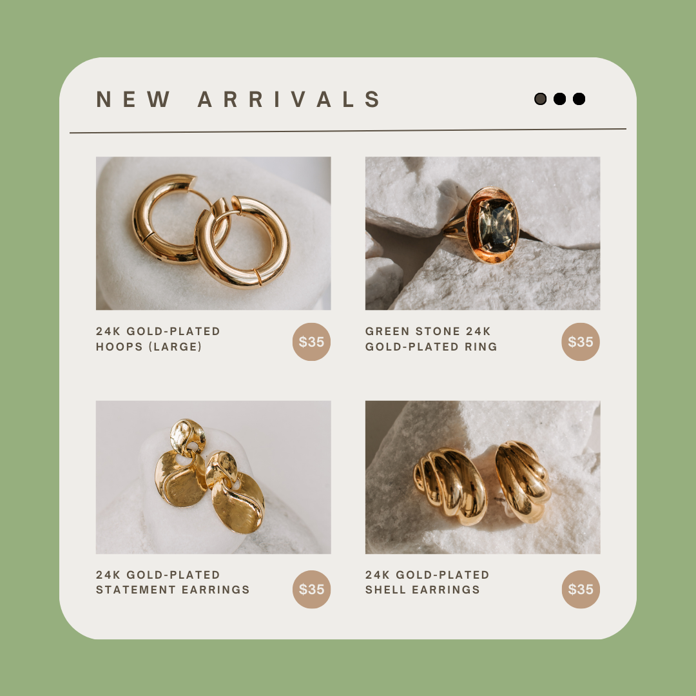

# Lumière Luxe & Co. Ecommerce Site

## Welcome to LL&Co, your go-to online store for sustainable and health-conscious products.

### Designed with Canva and Figma - crafted with NextJS, TypeScript and DaisyUI.

- [Overview](#overview)
- [Site](#site)
- [Features](#features)
- [Installation](#installation)
- [Usage](#usage)
- [Contributing](#contributing)
- [Contact](#contact)


## Overview

Lumière Luxe & Co. /loo·mee·air/ is an ecommerce platform dedicated to offering products that promote both personal health and environmental sustainability. Our mission is to provide consumers with a convenient way to shop for goods that are good for their bodies and the planet.

Inspired by the French word for "light" as a reference to physical light or metaphorical light such as enlightenment or illumination - LL&Co is the embodiment of trying to bring to light items which often get overlooked in a world of fast fashion and consumerism. Items listed have been made sustainably and are a product of being sourced in a humanitarian manner. While many sites offer high quality products that are sourced from unknown places at a higher cost for revenue, LL&Co provides high quality items at a reasonable price as an equal pay opportunity to its manufacturers as well and it's makers. 

## Site

#### Logo was made to reflect minimalism and elegance by incorporating sun and greenery 
The "Lumière Luxe & Co." logo elegantly captures the brand's essence of luxury and sustainability.

1. Shape and Layout:

The logo is framed within an oval, symbolizing timeless elegance and continuity.

2. Iconography:

A radiant sun sits at the top, representing light, warmth, and the brand’s name, "Lumière."
Bordering the bottom of the oval are delicate eucalyptus leaves, symbolizing natural beauty, purity, and the brand's commitment to eco-friendly practices.

3. Text:

The name "Lumière Luxe & Co." is prominently displayed within the oval, with "Lumière Luxe" in an elegant serif font to convey luxury and sophistication, and "& Co." in a modern sans-serif font to add a contemporary touch.

4. Color Palette:

Gold: Used for the sun, emphasizing luxury and high quality.
Soft Green: For the eucalyptus leaves, highlighting sustainability and a connection to nature.
White or Soft Beige: Background or accent colors to maintain a clean and pure look.




#### Site includes hero image that changes whenever new product is added to highlight new items.

#### New items are listed with new tag that last 7 days  from day of upload

#### Shopping cart has ability to be an anonymous shopper or make a profile to keep items in cart for future purchase.

#### Mood Board of site was made with the thought of keeping site natural and earthy while also keeping products at the center of attention through images that highlight them.

#### Image is a reflection of what email subscribers could potentially receive to showcase new items - reflects the mood board aesthetic.



## Features


- **Product Categories:** Browse through a wide range of categories including jewelry, eco-friendly skincare, sustainable home goods, and more.
- **Search and Filter:** Easily find products using our search functionality and filter options based on price, category, or sustainability criteria.
- **Secure Checkout:** Enjoy a seamless and secure checkout process with multiple payment options. -- To be added.
- **User Accounts:** Create a user account to save your favorite items, track orders, and manage subscriptions.
- **Community Engagement:** Stay informed about sustainability trends and health tips through our blog and social media channels.

# Installation

This is a [Next.js](https://nextjs.org/) project bootstrapped with [`create-next-app`](https://github.com/vercel/next.js/tree/canary/packages/create-next-app).

### Getting Started

First, run the development server:

```bash
npm run dev
# or
yarn dev
# or
pnpm dev
# or
bun dev
```

Open [http://localhost:3000](http://localhost:3000) with your browser to see the result.

You can start editing the page by modifying `app/page.tsx`. The page auto-updates as you edit the file.

This project uses [`next/font`](https://nextjs.org/docs/basic-features/font-optimization) to automatically optimize and load Inter, a custom Google Font.

### Learn More

To learn more about Next.js, take a look at the following resources:

- [Next.js Documentation](https://nextjs.org/docs) - learn about Next.js features and API.
- [Learn Next.js](https://nextjs.org/learn) - an interactive Next.js tutorial.

You can check out [the Next.js GitHub repository](https://github.com/vercel/next.js/) - your feedback and contributions are welcome!

## Usage

1. **Browse Products:** Navigate through the categories or use the search bar to find products of interest.
2. **Add to Cart:** Click on a product to view details and add it to your cart.
3. **Checkout:** Review your cart, enter shipping and payment details, and complete your purchase.
4. **Manage Account:** Create an account to manage your orders, subscriptions, and preferences.

## Contributing

We welcome contributions to improve Lumière Luxe & Co.! Here's how you can contribute:

- Fork the repository
- Make your changes
- Submit a pull request

## Contact

Have questions or feedback? Reach out to me at [rivaskj07@gmail.com]